<!-- Hero banner premium: SVG puro, animado (SMIL), com troca automática dark/light do GitHub -->
<picture>
  <source media="(prefers-color-scheme: dark)" srcset="./dark.svg">
  <source media="(prefers-color-scheme: light)" srcset="./light.svg">
  
</picture>

 

## 👋 Sobre mim

- 🔭 Atualmente trabalhando em **[nome do projeto]**
- 🌱 Aprendendo **[tecnologia que está estudando]**
- 💬 Pergunte-me sobre **JavaScript, React, Node.js**
- 📫 Como me encontrar: **seu-email@exemplo.com**
- ⚡ Fun fact: **[algo divertido sobre você]**

 

## 🚀 Stack & Tecnologias

 

## 📊 Estatísticas do GitHub

 

 

 

## 🏆 Troféus

 

## 🌐 Conecte-se comigo

 

